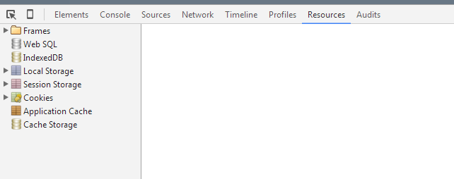
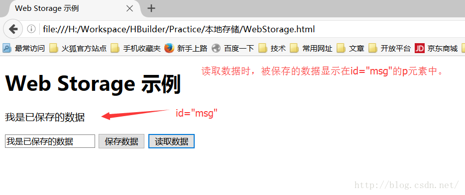

原文链接：https://www.cnblogs.com/pengc/p/8714475.html

## cookies、session解释及区别

在浏览器查看



### HTML4的本地存储 cookie

浏览器的缓存机制提供了可以将用户数据存储在客户端的方式，可以利用cookie，session等跟服务端进行数据交互。

一、cookies和session

cookie和session都是用来跟踪浏览器用户身份的会话方式。

区别：

1. 保持状态：cookie保存在浏览器端，session保存在服务器端。

2. 使用方式：

   1. cookie机制：如果不在浏览器中设置过期时间，cookie被保存在内存中，生命周期随着浏览器的关闭而结束，这种cookie简称会话cookie。如果在浏览器中设置了cookie的过期时间，cookies被保存在硬盘中，关闭浏览器后，cookie数据仍然存在，直到过期时间结束才消失。

      cookie是服务器发送给客户端的特殊信息，cookie是以文本的方式保存在客户端，每次请求的时候都带上它。

   2. session机制：当服务器收到请求需要创建session对象时，首先会检查客户端请求中是否包含sessionid。如果有sessionid，服务器将根据该id返回对应session对象。如果客户端请求中没有sessionid，服务器会创建新的session对象，并把sessionid在本次响应中返回给客户端。通常使用cookie方式存储sessionid到客户端，在交互中浏览器按照规则将sessionid发送给服务器。如果用户禁用cookie，则要使用URL重写，可以通过response.encodeURl(url)进行实现；API对encodeURl的结束为，当浏览器支持cookie时，url不做任何处理；当浏览器不支持cookie时，将会重写URL将sessionid拼接到访问地址后。

3. 存储内容：cookie只能保存字符串类型，以文本的方式；session通过类似与Hashtable的数据结构来保存，能支持任何类型的对象（session中可包含多个对象）。
4. 存储大小：
   1. cookie：单个cookie保存的数据不能超过4kb。
   2. session：大小没有限制。

5. 安全性：
   1. cookie：cookie欺骗、cookie截获。
   2. session：session的安全性大于cookie。
      1. sessionid存储在cookie中，若要攻破session首先要攻破cookie；
      2. sessionid是要人登陆，或者启动session_start才会有，所以攻破cookie也不一定能得到sessionid。
      3.  第二次启动session_start后，前一次的sessionid就是失效了，session过期后，sessionid也随之失效。
      4. sessionid是加密的。
      5. 综上所述，攻击者必须在短时间内攻破加密的sessionid，很难。

6. 应用场景：

   cookie：

   1. 判断用户是否登陆过网站，以便于下次登录时能够实现自动登录（或记住密码）。如果我们删除cookie，则每次登陆必须重新填写登陆的相关信息。

   2. 保存上次登陆的时间等信息。

   3. 保存上次查看的页面。

   4. 浏览次数。

      

   Session: session用于保存每个用户的专业信息，变量的值保存在服务器端，通过sessionid来区分不同的客户。

   1. 网上商城的购物车。
   2. 保存用户的登陆信息。
   3. 将某些数据放入session中，供同一用户的不同页面使用。
   4. 防止用户非法登陆。

7. 缺点：

   cookie：

   1. 大小受限制。
   2. 用户可以操作（禁用）cookie，使功能受限。
   3. 安全性较低。
   4. 有些状态不可能保存在客户端。
   5. 每次访问都要传送cookie给服务器，浪费带宽。
   6. cookie数据有路径（path）的概念，可以限制cookie只属于某个路径下。 

   session：

   1. session保存的东西越多，就越占用服务器内存，对于用户在线人数较多的网站，服务器压力就比较大。
   2. 依赖于cookie（sessionid保存在cookie），如果禁用cookie，则要使用URL重写，不安全。
   3. 创建session变量有很大的随意性，可随时调用，不需要开发者做到精确地处理，所以，过度使用session变量会导致代码不可读而且不好维护。


## sessionStorage和localStorage解释和区别


### HTML5的本地存储

#### 解释一

HTML5中与本地存储相关的两个重要内容：Web Storage与本地数据库。其中，Web Storage存储机制是对HTML4中cookie存储机制的一个改善。由于cookie存储机制有很多缺点，HTML5不再使用它，转而使用改良后的Web Storage存储机制。本地数据库是HTML5中新增的一个功能，使用它可以在客户端本地建立一个数据库，原本必须保存在服务器端数据库中的内容现在可以直接保存在客户端本地了，这大大减轻了服务器端的负担，同时也加快了访问数据的速度。

本文主要来讲解Web Storage

我们知道，在HTML4中可以使用cookie在客户端保存诸如用户名等简单的用户信息，但是，通过长期的使用，你会发现，用cookie存储永久数据存在以下几个问题：

1. 大小：cookie的大小被限制在4KB。

2. 带宽：cookie是随HTTP事务一起被发送的，因此会浪费一部分发送cookie时使用的带宽。

3. 复杂性：要正确的操纵cookie是很困难的。

针对这些问题，在HTML5中，重新提供了一种在客户端本地保存数据的功能，它就是Web Storage。

具体来说，Web Storage又分为两种：

1. sessionStorage：将数据保存在session对象中。所谓session，是指用户在浏览某个网站时，从进入网站到浏览器关闭所经历的这段时间，也就是用户浏览这个网站所花费的时间。session对象可以用来保存在这段时间内所要求保存的任何数据。
2. localStorage：将数据保存在客户端本地的硬件设备（通常指硬盘，也可以是其他硬件设备）中，即使浏览器被关闭了，该数据仍然存在，下次打开浏览器访问网站时仍然可以继续使用。

这两者的区别在于，sessionStorage为临时保存，而localStorage为永久保存。

到目前为止，**Firefox3.6以上、Chrome6以上、Safari 5以上、Pera10.50以上、IE8以上版本的浏览器支持sessionStorage与localStorage的使用**。


#### 解释二

WebStorage的目的是克服由cookie所带来的一些限制，当数据需要被严格控制在客户端时，不需要持续的将数据发回服务器。

WebStorage两个主要目标：（1）提供一种在cookie之外存储会话数据的路径。（2）提供一种存储大量可以跨会话存在的数据的机制。

HTML5的WebStorage提供了两种API：localStorage（本地存储）和sessionStorage（会话存储）。

1. 生命周期：

   localStorage的生命周期是永久的，关闭页面或浏览器之后localStorage中的数据也不会消失。localStorage除非主动删除数据，否则数据永远不会消失。

   

   sessionStorage的生命周期是在仅在当前会话下有效。sessionStorage引入了一个“浏览器窗口”的概念，sessionStorage是在同源的窗口中始终存在的数据。只要这个浏览器窗口没有关闭，即使刷新页面或者进入同源另一个页面，数据依然存在。但是sessionStorage在关闭了浏览器窗口后就会被销毁。同时独立的打开同一个窗口同一个页面，sessionStorage也是不一样的。

2. 存储大小：localStorage和sessionStorage的存储数据大小一般都是：5MB

3. 存储位置：localStorage和sessionStorage都保存在客户端，不与服务器进行交互通信。

4. 存储内容类型：localStorage和sessionStorage只能存储字符串类型，对于复杂的对象可以使用ECMAScript提供的JSON对象的stringify和parse来处理

5. 获取方式：localStorage：window.localStorage；sessionStorage：window.sessionStorage。

6. 应用场景：localStoragese：常用于长期登录（+判断用户是否已登录），适合长期保存在本地的数据。sessionStorage：敏感账号一次性登录/


**WebStorage的优点：**

（1）存储空间更大：cookie为4KB，而WebStorage是5MB。

（2）节省网络流量：WebStorage不会传送到服务器，存储在本地的数据可以直接获取，也不会像cookie一样每次请求都会传送到服务器，所以减少了客户端和服务器端的交互，节省了网络流量。

（3）对于那种只需要在用户浏览一组页面期间保存而关闭浏览器后就可以丢弃的数据，sessionStorage会非常方便。

（4）快速显示：有的数据存储在WebStorage上，再加上浏览器本身的缓存。获取数据时可以从本地获取会比从服务器端获取快得多，所以速度更快；（4）

（5）安全性：WebStorage不会随着HTTP header发送到服务器端，所以安全性相对于cookie来说比较高一些，不会担心截获，但是仍然存在伪造问题；

（6）WebStorage提供了一些方法，数据操作比cookie方便。

    1. setItem(key, value)----保存数据，以键值对的方式存储信息。
       2. getItem(key)----获取数据，将键值传入，即可获取到对应的value值。
       3. removeItem(key)----删除单个数据，根据键值移除对应的信息。
       4. clear()----删除所有数据
       5. key(index)----获取某个索引的key


#### cookie 、sessionStorage与localStorage的区别


#### sessionStorage与localStorage的使用示例。

首先，准备一个用来保存数据和显示数据的网页

```html
<!DOCTYPE html>
<html>
    <head>
    <meta charset="UTF-8">
    <title>Web Storage 示例</title>
    </head>
    <body>
    <h1>Web Storage 示例</h1>
    <p id="msg"></p>
    <input type="text" id="input" />
    <input type="button" value="保存数据" onclick="saveStorage('input');" />
    <input type="button" value="读取数据" onclick="loadStorage('msg');" />
    </body>
</html>
```

单击"保存数据"按钮时调用saveStorage方法保存数据，单击"读取数据"按钮时调用loadStorage方法调用数据，这两个方法均在脚本文件script.js中，如下：

```js
//sessionStorage 示例  (保存一个会话周期:从打开浏览器——到关闭浏览器窗口)
function saveStorage(id){
    var target=document.getElementById(id);
    var str=target.value;
    sessionStorage.setItem("message",str);
    //或者sessionStorage.message=str;
}
function loadStorage(id){
    var target=document.getElementById(id);
    var msg=sessionStorage.getItem("message");
    //或者var msg=sessionStorage.message;
    target.innerHTML=msg;
}
//localStorage 示例(可永久保存)    
function saveStorage(id){
    var target=document.getElementById(id);
    var str=target.value;
    localStorage.setItem("message",str);
    //或者localStorage.message=str;
}
function loadStorage(id){
    var target=document.getElementById("msg");
    var msg=localStorage.getItem("message");
    //或者var msg=localStorage.message;
    target.innerHTML=msg;
}
```

这个脚本文件分别使用了sessionStorage与localStorage两种方法。这两种方法都是当用户在input文本框中输入内容后单击"保存数据"按钮保存数据，单击"读取数据"按钮读取保存后的数据。但是两种方法对数据的处理方式不一样，在使用sessionStorage方法时，如果关闭了浏览器，这个数据就丢失了，下一次打开浏览器单击"读取数据"按钮时，读取不到任何数据。在使用localStorage方法时，即使浏览器关闭了，下次打开浏览器时仍然能够读取保存的数据。不过，数据保存是按不同的浏览器分别进行保存的，也就是说，打开别的浏览器是读取不到在这个浏览器中保存的数据的。

下面具体看一下读写数据时使用的基本方法

1. sessionStorage

   保存数据的方法：

   ```js
   sessionStorage.setItem("key","value");
   //或者写成
   sessionStorage.key="value";
   ```

   读取数据的方法：

   ```js
   变量=sessionStorage.getItem("key");
   //或者写成
   变量=sessionStorage.key;
   ```

2. localStorage

   保存数据的方法：

   ```js
   localStorage.setItem("key","value");
   //或者写成
   localStorage.key="value";
   ```

   读取数据的方法：

   ```js
   变量=localStorage.getItem("key");
   //或者写成
   变量=localStorage.key;
   ```


在保存数据时，若使用sessionStorage读取或保存数据，则使用sessionStorage对象并调用该对象的读写方法；若使用localStorage读取或保存数据，则使用localStorage对象并调用该对象的读写方法。
在进行读写时，不管是哪个对象，都可以通过该对象的getItem方法来读取数据，也可以该对象的自定义属性值读取数据；可以通过该对象的setItem方法保存数据，也可以通过该对象的自定义属性值保存数据。保存数据时按“键名/键值”的形式进行保存。当通过该对象的getItem方法读取数据时，将参数指定为键名，该方法返回键值；当通过该对象的自定义属性值读取数据时，可以将该对象的某个自定义属性名作为键名，访问该自定义属性的属性值即可得到键值；当通过该对象的setItem方法保存数据时，将第一个参数指定为键名，将第二个参数指定为键值；当通过该对象的自定义属性值保存数据时，可以将该对象的某个自定义属性名作为键名，然后直接将该自定义属性值设置为键值。

在保存数据时不允许重复保存相同的键名。保存后可以修改键值，但不允许修改键名(只能重新取键名，然后再保存键值)。

最后，这个示例在浏览器中的运行结果如下：



